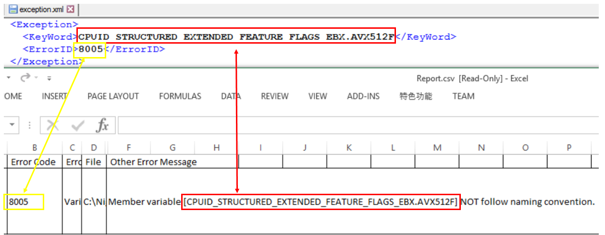

# 1. What is ECC tool?
ECC is a python tool which is help to check the EDKII C coding style. 
It will report error for the codes which don't follow EDKII C coding style. 
EDK II C Coding Standards Specification： 
https://edk2-docs.gitbooks.io/edk-ii-c-coding-standards-specification/content/

# 2. Where is ECC tool?
ECC tool is located in edk2/BaseTools/Source/Python/Ecc.

# 3. How to run ECC tool? 
Steps to run ECC tool: 
**1). Enter edk2 directory, run: **edksetup.bat**** (**on Windows**) 
      **Enter edk2 directory, run: **source edksetup.sh**** (**on Linux**) 

**2). Then in edk2 directory, you can type "Ecc" to run ECC tool directly**. 

**3). If you meet following error:** 
    **import antlr3** 
    **ImportError: No module named antlr3** 

Since ECC depends on antlr V3.0.1, you can download it from http://www.antlr3.org/download/Python/  
After download and extract it, you can enter the antlr tool directory and run:  
**C:\Python27\python.exe setup.py install** to install it.(**on Windows**)  
**python setup.py install**" to install it, root access may be required.(**on Linux**)  

**4). You can type "Ecc -h/Ecc --help" to get the help info of ECC tool**. 

**5). Common usage model:** 
**Ecc -c config file  -e exception file  -t  the target directory which need to be scanned by ECC -r the ECC scan result csv file** 
(Notes: Please use the full path when specify the target directory to scan.)

config.ini and exception.xml are in edk2/BaseTools/Source/Python/Ecc dir. 
**Config.ini** is the configuration file of ECC tool. If config file is not specified when run ECC, it will use the one in Edk2/BaseTools/Source/Python/Ecc directory by default. 
**exception.xml** is used to skip some specific coding style issues. 

For example, run ECC to check the coding style in Mdepkg: 
**Ecc –c  D:/AWORK/edk2/BaseTools/Source/Python/Ecc/config.ini**
**-e D:/AWORK/edk2/BaseTools/Source/Python/Ecc/exception.xml -t D:/AWORK/edk2/MdePkg -r MdePkgECC.csv**  

(Notes: When run ECC for a specific sub-dir, it may report some error such as some library instance are not used, but when run ECC for the whole project, these errors are gone. So we can ignore such kind of error when run ECC for a specific sub-dir.) 

**6). You may need to maintain the config.ini and exception.xml files by yourself for your project.** 

**a) If you want to skip to check some sub-dir or file, you can add them to the SkipDirList, SkipFileList part in the config.ini.** 
A list for skip dirs when scaning source code  
SkipDirList = **BUILD, ...,** TEST\\TEST  
A list for skip file when scaning source code  
SkipFileList = **.gitignore,...**  

**b) If you want to skip a specific ECC error, you can add them to the exception.xml file.** 
The mapping relationship between exception format and ECC error like below.

