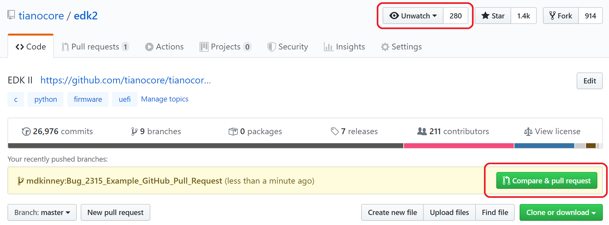
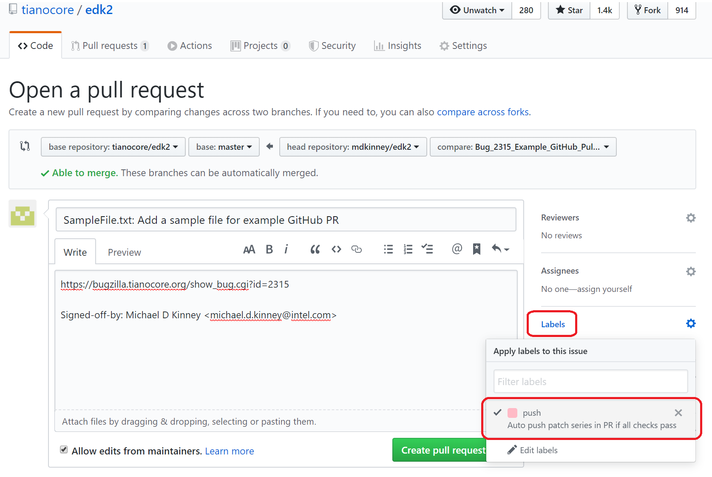

First check out [[Getting Started with EDK II]] for downloading the
latest EDK II development project with your build environment.

Are you new to using git? If so, then the [[New to git]] page may be
helpful.

The developer process for the EDK II project
--------------------------------------------

1.  Setup the EDK II tree if you do not have one

    * This is document on the [[SourceForge to Github Quick Start]] page

2.  Create and checkout a topic branch for new feature or bug fix

    `$ git checkout -b <new-dev-branch> origin/master`

3.  Make changes in the working tree

4.  Break up working tree changes into independent commits that do not
    break *git bisect*
    -   [Commit-Partitioning](Commit-Partitioning "wikilink")

    -  To stage all modifications: `$ git add -u`

    -  To add new files: `$ git add <path-to-new-file>`

    -  To have git prompt you to selectively stage changes: `$ git add -p`

5.  Follow the commit message template given below when writing commit
    messages

    - [Commit-Message-Format](Commit-Message-Format "wikilink")

    - To commit staged changes: `$ git commit`

      - Add the `-s` parameter to automatically append your
        Signed-off-by tag to the commit message.

6.  Use the ‘PatchCheck.py’ script under ‘edk2\\BaseTools\\Scripts’
    directory to verify the commits are correctly formatted

    - To check the latest <N> changes: `$ python BaseTools/Scripts/PatchCheck.py -<N>`

      - For example, 2 changes would be: `$ python BaseTools/Scripts/PatchCheck.py -2`

    - It is strongly recommended that you run PatchCheck.py after each
      commit. You can then easily amend the commit to correct any
      issues.

7.  Get the latest changes from origin

    `$ git fetch origin`

    Note: This updates origin/master, but not your local master
    branch. (origin/master may have newer commits than master.)

8.  Rebase the topic branch onto master branch

    `$ git rebase origin/master`

9. Create patch (serial) to the [[edk2-devel]] mailing list

    - Clean out any old patches: `$ rm *.patch`

    - Generate new patch files: `$ git format-patch -M --thread origin/master`

      - Add the `--cover-letter` parameter for long patch series. (Be
        sure to edit the cover-letter.)

      - Add the `--subject-prefix="PATCH v2"` if you are sending out a
        second version of the patch series.

    - `$ git send-email *.patch`

10. Modify local commits based on the review feedbacks and repeat steps
    3 to 9

    - For the latest commit, you can use `$ git commit --amend`

    - For multiple commits use `$ git rebase -i origin/master`

    - Consult your git gurus on edk2-devel or irc channel if you have
      questions.

The maintainer process for the EDK II project
---------------------------------------------

1.  Determine if a patch has met the review requirements for the package

2.  Update the origin/master from the server

    `$ git fetch origin`

3.  Create and checkout an integration branch

    `$ git checkout -b <new-integration-branch> origin/master`

4.  Add commits on the integration branch

    `$ git am <patch-file>`

5.  Rebase commit message to include any reviewed-by or other
    attributions

    `$ git rebase -i origin/master`

    - Edit lines to have an 'r' to 'reword' the commit. This will
      allow you to add the Reviewed-by attributions.

6.  Push changes to the EDK II maintainer's fork of the EDK II project
    repository.
    - How to create a [GitHub fork](https://help.github.com/en/github/getting-started-with-github/fork-a-repo)
      - **NOTE:** A GitHub fork can also be created using the command line
        utility called [`hub`](https://github.com/github/hub/releases).  The
        `hub` usage information can be found [here](https://hub.github.com/hub.1.html).

    - Add remote to the EDK II maintainer's fork of the EDK II project

    `$ git remote add <maintainer-id> https://github.com/<maintainer-id>/edk2.git`

    - Push the integration branch.

    `$ git push <maintainer-id> <new-integration-branch>`

7.  Create a GitHub pull request from the EDK II maintainer's
    `<new-integration-branch>`  to `edk2/master` setting the **`push`** label.
    If all checks pass, the changes are strict rebase merged.  If the
    **`push`** label is not set, then the checks are run, but no changes are
    merged.

    - How to create a [GitHub pull request](https://help.github.com/en/github/collaborating-with-issues-and-pull-requests/creating-a-pull-request)
      - **NOTE:** A GitHub pull request can also be created using the command
        line utility called [`hub`](https://github.com/github/hub/releases).
        The `hub` usage information can be found [here](https://hub.github.com/hub.1.html).

    - Add the [TianoCore Bugzilla](https://bugzilla.tianocore.org/) issue
      number(s) resolved by the pull request to the pull request title.

    - If `<new-integration-branch>` is a patch series, then copy the patch #0
      summary into the pull request description.

    - If the EDK II Maintainer wants the patches from `<new-integration-branch>`
      to be merged into `edk2/master` using strict rebase, then the **`push`**
      label must be set.  By default, pull requests to `edk2/master` are
      personal builds that perform checks and provide results, but no commits
      are automatically made to `edk2/master`.

    - Email notifications for pull requests, pushes, and check status results
      are enabled by watching the EDK II repository (https://github.com/tianocore/edk2).
      How to [Watch a GitHub repository](https://help.github.com/en/github/receiving-notifications-about-activity-on-github/watching-and-unwatching-repositories)

    - The figure below shows an example creating a GitHub pull request.  The
      red box at the top shows that the edk2 repository is being watched.  It
      also shows that GitHub observed that a new EDK II Maintainer branch
      `Bug_2315_Example_GitHub_Pull_Request` was pushed and is now available to
      create a pull request against `edk2/master` by selecting the button labeled
      `Compare & pull request`.

      

    - The figure below shows the title and description of the pull request as
      well as the `Labels` button on the right that is used to enable/disable
      the **`push`** label.

      

8.  Resolve GitHub pull request issues.  A pull request to `edk2/master` may
    fail for the conditions listed below.  If a failure is detected, then the
    EDK II Maintainer must resolve the issue(s) on their local branch (outside
    of GitHub).  If any code changes are required, then the issue(s) are handed
    back to the contributor(s) to resolve, test, and perform another round of
    reviews on the mailing list.  Once the issues are resolved and reviewed,
    the EDK II Maintainer can either open a new GitHub pull request or do a
    forced push to `<new-integration-branch>`.  If a forced push is used, then
    the pull request checks are automatically restarted.

    - A merge conflict is detected.  The pull request remains open.  The EDK II
      Maintainer may attempt to resolve the merge conflicts outside of GitHub
      by rebasing `<new-integration-branch>` with `edk2/master`.  If this is
      successful with no code changes, then a forced push to
      `<new-integration-branch>` automatically restarts the checks.  If code
      changes are required, then the patches are returned to the contributor.

    - The pull request fails the `PatchCheck.py` check.  The pull request
      remains open.  The EDK II maintainer may attempt to resolve the
      `PatchCheck.py` issues with trivial changes to the commit message or patch
      set.  A forced push to `<new-integration-branch>` can be used to
      automatically restart the checks.  If code changes are required, then the
      patches are returned to the contributor.

    - The pull request fails Windows or Ubuntu checks.  The pull request
      remains open.  The patches are returned to the contributor.  The GitHub
      pull request provides links to the Azure Pipelines results that are used
      to view test results for checks that failed.

    - The pull request submitter is not a member of the TianoCore EDK II
      Maintainers team and the **`push`** label is set.  The pull request is
      ignored and automatically closed.

9.  Update [TianoCore Bugzilla](https://bugzilla.tianocore.org/) issue(s)
    resolved by the commit(s).

    - Add a pointer to the GitHub pull request (e.g.
      https://github.com/tianocore/edk2/pull/153).

    - Add the SHA hash range pushed to `edk2/master` (e.g. Pushed as
      cc6854506c..f8dd7c7018).

    - Mark BZ issues as Resolved/Fixed.

Updating your master branch
---------------------------

1.  Get the latest changes from origin

    `$ git fetch origin`

2.  Change to the local master branch

    `$ git checkout master`

3.  Apply the latest server changes to you local master branch.

    `$ git rebase origin/master`

**See Also**
------------

-   [[Commit-Message-Format]]
-   [[Code-Style]]
