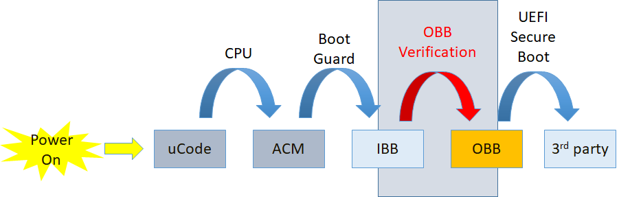
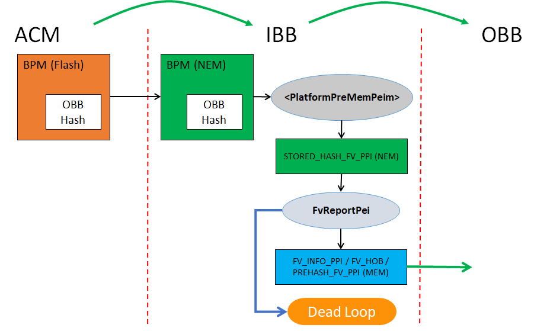

OBB (Oem Boot Block) Verification is a common solution of maintaining the Chain-of-Trust in edk2 based firmware. It fills the gap between IBB (Initial Boot Block, verified by Root-of-Trust) and 3rd-party image (like OS loader, verified by Secure Boot). Following figure shows the point at which the OBB Verification complete the Chain-of-Trust in firmware.

A typical IBB contains all firmware code/data running before physical memory discovered, and a typical OBB contains firmware code/data running in physical memory. In this solution, OBB must be in the form of FV (Firmware Volume). More than one FV are allowed.

The solution is implemented by module [FvReportPei](https://github.com/tianocore/edk2/tree/master/SecurityPkg/FvReportPei). It must be built into and running as part of IBB, which is verified by ACM (Authenticated Code Module). This PEIM is platform independent, which means it doesn't have any platform specific information hard-coded to complete its work. A new PPI, [STORED_HASH_FV_PPI](https://github.com/tianocore/edk2/blob/master/SecurityPkg/Include/Ppi/FirmwareVolumeInfoStoredHashFv.h), is introduced for platform to pass information (such as FV address and size, OBB hash algorithm and value, etc.) of FVs to this PEIM.

A platform usually reports FVs to PEI Core and/or DXE Core via FV HOB or FV_INFO PPI for dispatching. If OBB Verification solution is employed in the platform, [STORED_HASH_FV_PPI](https://github.com/tianocore/edk2/blob/master/SecurityPkg/Include/Ppi/FirmwareVolumeInfoStoredHashFv.h) must be used instead to report those information, plus OBB hash information. [FvReportPei](https://github.com/tianocore/edk2/tree/master/SecurityPkg/FvReportPei) will consume this PPI and verify those FVs, and then, if passed, report them to PEI Core and/or DXE Core accordingly (via FV HOB and/or FV_INFO PPI). Otherwise, [FvReportPei](https://github.com/tianocore/edk2/tree/master/SecurityPkg/FvReportPei) will stop the boot process without passing the control back to PEI Core then no chance to OBB. Following figure shows a typical usage and boot flow with OBB verification based on Intel® Boot Guard.

Status code, [PcdStatusCodeFvVerificationPass](https://github.com/tianocore/edk2/blob/master/SecurityPkg/SecurityPkg.dec) or [PcdStatusCodeFvVerificationFail](https://github.com/tianocore/edk2/blob/master/SecurityPkg/SecurityPkg.dec), will be also reported upon verification pass or failure. The platform could register its own status code handler to intercept the result and does platform specific handling for the verification result.

To boost the boot performance, only hash algorithm (SHA256 or beyond) is currently used to verify the integrity of OBB. Other ways could be supported in the future, if requested. To save time in measurement boot, [PREHASH_FV_PPI](https://github.com/tianocore/edk2/blob/master/SecurityPkg/Include/Ppi/FirmwareVolumeInfoPrehashedFV.h) is also installed to report the digest of each FV along side the OBB FV verification. Then the TCG driver consuming the PPI doesn't have to re-calculate the hash for each of them, if the same hash algorithm is used for both OBB Verification and TPM measurement.

To meet above requirements, the OBB hash value must be calculated in following way

> If OBB = FV1 + FV2 + FV3,
>
>       FV1 -> FV1_Digest
>
>       FV2 -> FV2_Digest
>
>       FV3 -> FV3_Digest
>
>       FV1_Digest + FV2_Digest + FV3_Digest -> OBB Hash
>

There's only one hash value allowed as OBB hash for one boot mode. As long as the FVs information is passed in the same order as in OBB hash calculating, [FvReportPei](https://github.com/tianocore/edk2/tree/master/SecurityPkg/FvReportPei) is able to get the separate hash value for each FV as well as final OBB hash value, without repeated calculations. 

OBB hash value and algorithm information must be stored in a way being able to be verified by Root-of-Trust such as BPM (Boot Policy Manifest) in Intel® Boot Guard. How to do it is a platform choice and varies per different hardware security technologies. Nevertheless, to avoid TOCTOU vulnerability, the OBB hash information (hash value, FV_INFO) as well as all OBB data itself must be stored and accessed in a more secure place, like memory, once they're verified. Both platform code and [FvReportPei](https://github.com/tianocore/edk2/tree/master/SecurityPkg/FvReportPei) must make sure of it.

Different boot modes may have different OBB data (FVs) then different OBB hash for the sake of performance or other considerations. For example, normal boot mode may need to verify those FVs containing all drivers for PEI as well as DXE. But in S3 boot, only those drivers involved in S3 boot need verification. The platform developers can well organize those drivers into one FV and others into other FV(s), so that the firmware can skip verifying unwanted FVs to save boot time. How to store different OBB hash values for different boot modes is also a platform's choice.  Platform must pass the different OBB hash values through [STORED_HASH_FV_PPI](https://github.com/tianocore/edk2/blob/master/SecurityPkg/Include/Ppi/FirmwareVolumeInfoStoredHashFv.h) with correct flags to instruct [FvReportPei](https://github.com/tianocore/edk2/tree/master/SecurityPkg/FvReportPei) to verify the correct FVs against correct hash value.

Any tools or build process changes to support calculating OBB hash or generating OBB image are also platform's responsibility, not in the scope of this solution.